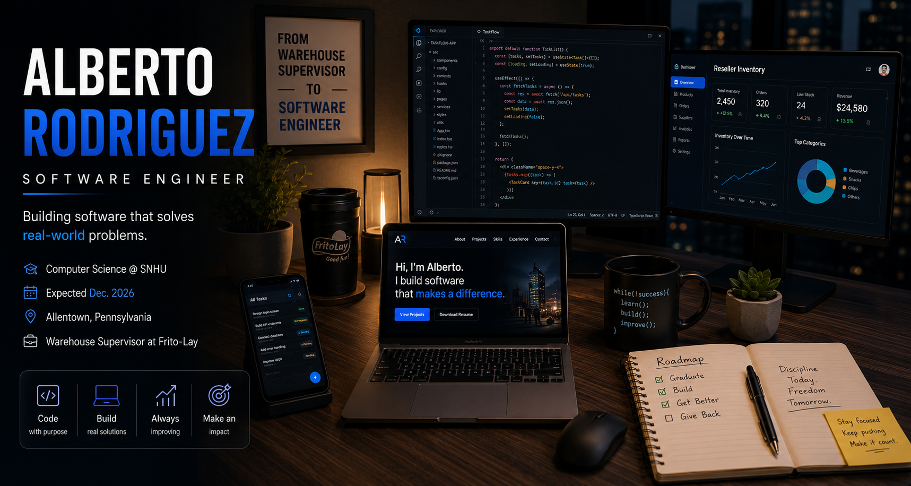

  

# Hi, I'm Alberto Rodriguez 👋

### Software Developer • Computer Science Student • Open to Software Engineering Opportunities

I'm a Computer Science student at **Southern New Hampshire University** with a passion for building software that solves real-world problems. I enjoy creating full-stack web applications, mobile apps, and developer-focused tools while continuously improving my skills in software engineering.

I'm currently seeking **Software Engineer**, **Software Developer**, **Associate Software Engineer**, and **New Graduate** opportunities.

---

# 🚀 About Me

🎓 Bachelor of Science in Computer Science  

Expected Graduation: **December 2026**

📍 Allentown, Pennsylvania

💼 Warehouse Supervisor at Frito-Lay

💡 Passionate about building software that makes a real impact.

---

# 💻 Technical Skills

## Languages

## Frontend

## Mobile & Databases

## Tools

---

# ⭐ Featured Projects

## 📦 Reseller Inventory

A mobile inventory management application built to help resellers organize products, monitor inventory, track profits, and improve workflow efficiency.

**Tech Stack**

Java • SQLite • Android Studio

**Highlights**

- Inventory Management

- Barcode Scanner

- Profit Tracking

- SMS Notifications

- Responsive Mobile Design

---

## 📝 TaskFlow

A productivity application designed to help users organize tasks, build habits, and stay motivated through gamification.

**Tech Stack**

React • JavaScript • HTML • CSS

**Highlights**

- Drag & Drop Tasks

- Dark Mode

- XP & Level System

- Daily Streaks

- Responsive Design

---

## 🌐 Personal Portfolio

A modern portfolio website showcasing my projects, technical skills, and software engineering journey.

**Features**

- Responsive Design

- Project Showcase

- Resume Download

- Contact Section

- Live Project Demos

---

# 🚀 Currently Building

- Improving my Portfolio Website

- Reseller Inventory v2

- OpenGL Graphics Projects

- Learning AWS Cloud Fundamentals

- Preparing for Software Engineering Interviews

---

# 🎯 2026 Goals

- Graduate with a Bachelor of Science in Computer Science

- Begin my career as a Software Developer

- Build production-ready software

- Contribute to open-source projects

- Continue learning cloud technologies and AI

---

# 📫 Let's Connect

📍 Allentown, Pennsylvania

📧 Alberto.r97@outlook.com

🌐 Portfolio

https://arod0210-cs.github.io/alberto-portfolio/

💻 GitHub

https://github.com/arod0210-CS

---

Thanks for visiting my profile!

I'm passionate about building software that solves real-world problems and continuously improving as a developer. If you're interested in collaborating, discussing technology, or exploring software engineering opportunities, I'd love to connect.
